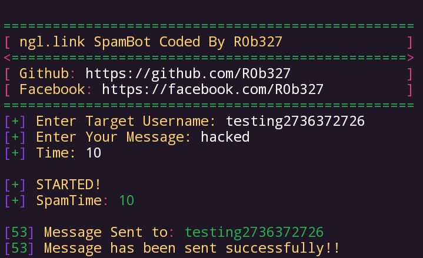
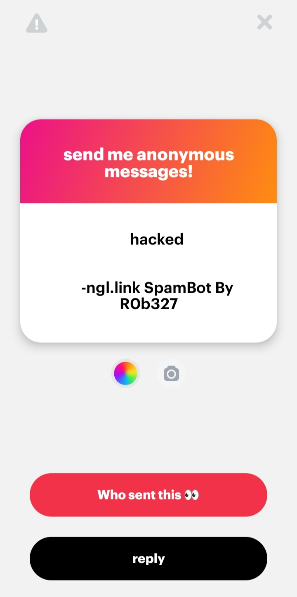

# NGL.LINK-SPAM-BOT
ngl.link spammer, just for fun:)

# Install
```
git clone https://github.com/R0b327/NGL.LINK-SPAM-BOT.git

cd NGL.LINK-SPAM-BOT

pip3 install -r requirements.txt

python3 NGL-SpamBot.py
```

# ScreenShot
<center>

<br>

<br>

</center>
